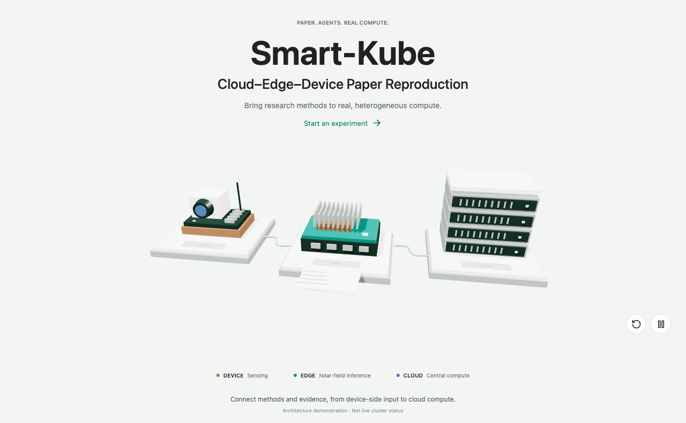
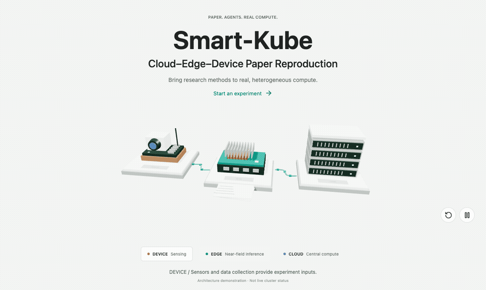
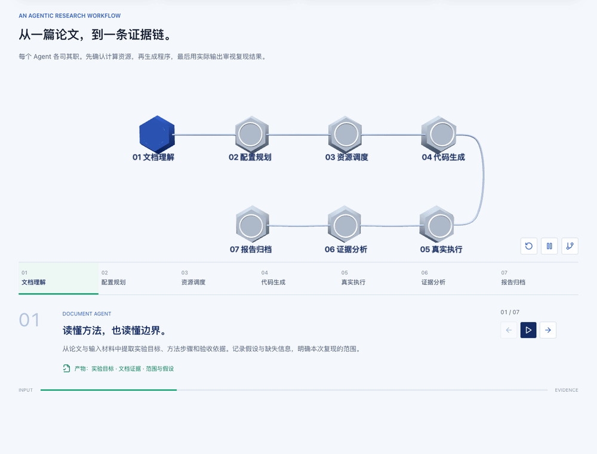
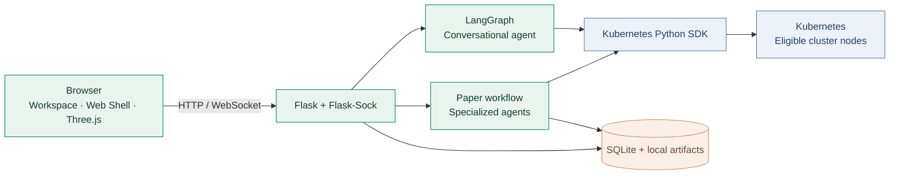

<div align="center">

<a href="https://cloudedgeiot.top/welcome.html"></a>

# Smart-Kube

### From papers to programs. From compute to evidence.

A multi-agent workspace for reproducing cloud–edge–device research on Kubernetes.

[简体中文](README.md) · [**English**](README.en.md)

[](requirements.txt)
[](backend/k8s_client.py)
[](backend/agent.py)
[](frontend/js/welcome_scene.js)
[](backend/paper_jobs.py)

[**Explore the interactive overview ↗**](https://cloudedgeiot.top/welcome.html) · [Quick start](#quick-start) · [Architecture](#architecture) · [Contributing](CONTRIBUTING.md)

</div>

---

## Research, connected

Smart-Kube connects source materials, resource planning, Kubernetes placement, generated code and execution evidence in one persistent experiment workspace. Conversational resource management, a browser shell, file transfer, collaboration and audit records support the experiment loop.

The aim is a **traceable reproduction process**. A successfully executed program is not a guarantee that a paper's scientific conclusions have been reproduced.

<a href="https://cloudedgeiot.top/welcome.html"></a>

<table>
<tr>
<td width="33%" valign="top">

### 🟧 Device
Sensors, data collection and experiment inputs.

**Research role**
Device-side workloads and observation.

</td>
<td width="33%" valign="top">

### 🟩 Edge
Near-field tasks on heterogeneous compute.

**Research role**
Collaborative inference and placement.

</td>
<td width="33%" valign="top">

### 🟦 Cloud
Central compute on x86 and available GPU nodes.

**Research role**
Compute-intensive experiment workloads.

</td>
</tr>
</table>

The scene illustrates the architecture. Schedulability depends on actual nodes, images, drivers and capacity; not every inventoried device is a Kubernetes worker.

## Seven stages. One evidence chain.



| Stage | Responsibility | Evidence retained |
| :--- | :--- | :--- |
| **01 · Understand** | Extract objectives, methods, acceptance criteria and assumptions. | Document evidence and experiment scope |
| **02 · Plan** | Combine paper evidence with a live cluster snapshot; replan on failed preflight. | Candidate configurations and diagnostics |
| **03 · Schedule** | Select eligible nodes and consider other node types when needed. | Resource instances, placements and fallback decisions |
| **04 · Generate** | Generate Python code and per-Unit run plans after all creation and placement requests succeed. | Downloadable code and run parameters |
| **05 · Execute** | Wait for runtime readiness, upload code and run in containers. | stdout, stderr, exit status and elapsed time |
| **06 · Analyze** | Compare actual evidence with the objective; record gaps and risks. | Checks, limitations and recommendations |
| **07 · Report** | Assemble a persistent experiment record. | Markdown report and retained artifacts |

**Two modes:** stop after resource scheduling and reporting, or continue through code generation, execution and analysis. Reclaiming compute keeps artifacts; deleting a workspace removes its resources, uploaded and generated files, records and associated experiment.

> Preflight is a snapshot, not a reservation. Kubernetes makes the final admission and scheduling decision. Architecture, GPU and explicit host requirements remain hard constraints; relaxing node type is recorded. Image pulls and runtime readiness can still fail after placement.

## Built for the experiment loop

| Capability | In practice |
| :--- | :--- |
| **Persistent workspaces** | Inputs, configuration, code, events, outputs and reports stay associated with one experiment. |
| **Conversational operations** | A LangGraph tool-calling agent manages authorized Kubernetes resources. |
| **Browser execution** | Web Shell, script upload and container execution reduce context switching. |
| **Model selection** | Select configured providers and models; jobs retain the model selected at submission. |
| **Collaboration** | Collaborator views and revocable share links, with operation and credential boundaries. |
| **Efficient reads** | Batched experiment pod counts, lightweight workspace summaries and status, and paginated audit logs. |

## Architecture



The conversational agent and paper workflow are separate orchestration paths. Both use server-side authorization and Kubernetes helpers. The application is currently **single-instance**: SQLite, local artifacts and background jobs need one active owner. Replication requires redesigning persistence, storage and job coordination.

## Quick start

Prerequisites: Python 3.10+, a reachable Kubernetes API with appropriate RBAC, and an OpenAI-compatible model endpoint. Conversational operations require tool calling; the paper Agent workflow requires a working model configuration.

```bash
git clone https://github.com/kimlinsung/smart-kube.git
cd smart-kube
python3 -m venv .venv
source .venv/bin/activate
pip install -r requirements.txt
cp config.yaml.example config.yaml
```

Edit `config.yaml` to configure the LLM, kubeconfig, namespace and credentials. For local development set `flask.host: 127.0.0.1` and `flask.port: 5000`. Replace the session secret, administrator password and container SSH password before starting.

```bash
kubectl --kubeconfig=/path/to/kubeconfig get nodes
python -m backend.app
```

Open **http://127.0.0.1:5000/welcome.html** and enter the workspace with your locally configured administrator account. See the [configuration template](config.yaml.example), [Chinese operations guide](docs/guide.zh-CN.md) and [architecture context](AGENTS.md).

<details>
<summary><strong>Repository map</strong></summary>

```text
backend/
  agent.py, tools.py              Conversational orchestration
  paper_agents.py, paper_jobs.py  Paper-to-experiment workflow
  scheduling.py, k8s_client.py    Preflight and Kubernetes integration
  db.py, routes_api.py            Persistence and REST API
  routes_shell.py, task_events.py WebSockets and task updates
frontend/
  welcome.html                   Public research overview
  js/welcome_scene.js             Interactive compute scene
  paper_workspace.html            Experiment workspace
tests/                            Backend regression coverage
docs/assets/                      Screenshots and GIFs
deploy/                           Service template
AGENTS.md                         Architecture and maintenance context
```

</details>

<details>
<summary><strong>Deployment and safety boundaries</strong></summary>

- Preserve `config.yaml`, `data/` and `uploads/` on updates. Back up code and the database before restarting.
- Keep one active writer. Restarting interrupts background jobs; deploy after they finish.
- Pod ownership checks do not replace network isolation. Review CNI, NetworkPolicy and node firewalls separately.
- GPU eligibility uses allocatable capacity and existing requests. Unknown image compatibility is not guaranteed.
- Keep secrets out of Git and remote URLs. Third-party frontend licenses live in `frontend/vendor/`.
- This repository currently has no project-wide LICENSE file; dependency licenses do not establish a license for this project.

</details>

## Development

```bash
python -m unittest discover -s tests -p 'test_*.py'
git diff --check
```

For public-page work, verify desktop and mobile rendering, keyboard interaction, reduced motion and the non-WebGL fallback. Read [CONTRIBUTING.md](CONTRIBUTING.md) before changing shared behavior.

<div align="center">

**Methods deserve evidence. Experiments deserve a record.**

[Explore Smart-Kube](https://cloudedgeiot.top/welcome.html) · [Report an issue](https://github.com/kimlinsung/smart-kube/issues) · [简体中文](README.md)

</div>
