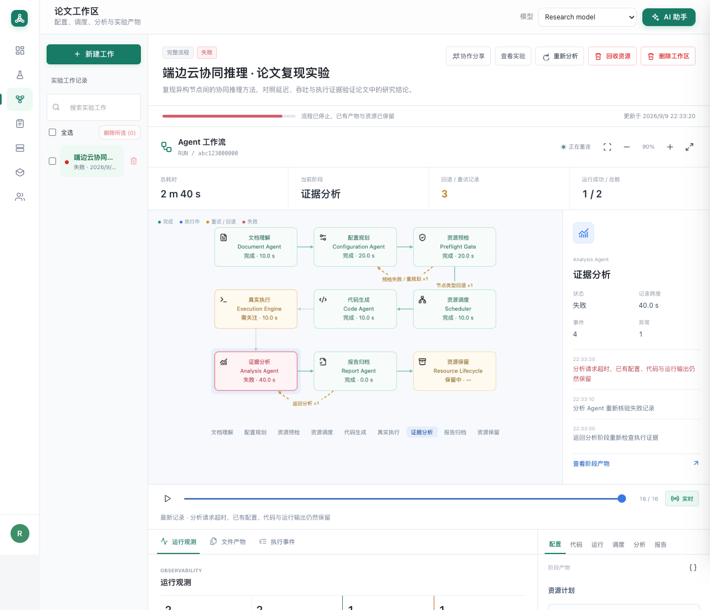
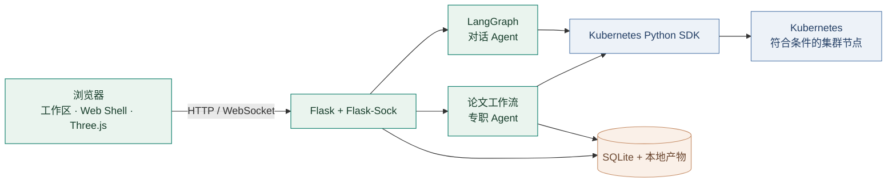

<div align="center">

<a href="https://cloudedgeiot.top/welcome.html"></a>

# Smart-Kube

### 从论文到程序，从算力到证据。

面向端边云研究的多 Agent 论文复现与 Kubernetes 实验工作区。

[**简体中文**](README.md) · [English](README.en.md)

[](requirements.txt)
[](backend/k8s_client.py)
[](backend/agent.py)
[](frontend/js/welcome_scene.js)
[](backend/paper_jobs.py)

[**探索交互式首页 ↗**](https://cloudedgeiot.top/welcome.html) · [快速开始](#快速开始) · [系统架构](#系统架构) · [参与贡献](CONTRIBUTING.md)

</div>

---

## 把研究的每一步连接起来

Smart-Kube 将论文材料、配置规划、Kubernetes 资源调度、代码生成和真实执行证据，连接到同一个持久化实验工作区。自然语言资源管理、浏览器终端、文件传输、实验协作与操作审计，共同支撑完整的实验过程。

我们关注的是**可追溯的复现过程**。程序运行成功，并不等于论文中的科学结论已经完整复现。

<a href="https://cloudedgeiot.top/welcome.html"></a>

<table>
<tr>
<td width="33%" valign="top">

### 🟧 端 · Device
感知、数据采集与实验输入。

**研究角色**
端侧工作负载与观测。

</td>
<td width="33%" valign="top">

### 🟩 边 · Edge
面向近端任务的异构计算。

**研究角色**
协同推理与任务分配。

</td>
<td width="33%" valign="top">

### 🟦 云 · Cloud
x86 与可用 GPU 节点上的集中计算。

**研究角色**
计算密集型实验工作负载。

</td>
</tr>
</table>

3D 场景展示 Agent 的阶段流转、证据传递和调度失败重试，不表示实时任务状态。实际调度取决于集群节点、镜像、驱动与可用资源。

## 七个阶段，一条证据链


| 阶段 | 负责什么 | 保留什么 |
| :--- | :--- | :--- |
| **01 · 文档理解** | 提取实验目标、方法、验收依据与假设。 | 文档证据、实验范围 |
| **02 · 配置规划** | 结合正文与集群实时快照形成方案；预检失败后携带诊断重新规划。 | 候选配置、预检诊断 |
| **03 · 资源调度** | 选择满足条件的节点；必要时尝试其他节点类型。 | 资源实例、节点落位、回退记录 |
| **04 · 代码生成** | 全部资源创建与落位请求成功后，生成 Python 程序和逐 Unit 运行计划。 | 可下载代码、运行参数 |
| **05 · 真实执行** | 等待容器就绪，上传代码并执行。 | stdout、stderr、退出状态、实际耗时 |
| **06 · 证据分析** | 对照真实输出检查结果，记录差距与风险。 | 检查项、局限、后续建议 |
| **07 · 报告归档** | 汇总过程与执行证据，形成持久化实验记录。 | Markdown 报告、完整产物 |

**两种执行模式：** 可以止于资源调度并生成报告，也可以继续代码生成、执行与分析。仅回收计算资源会保留实验产物；删除工作区会清理资源、上传与生成文件、记录和关联实验。

实验与工作区均支持单项、批量删除，以及通过 AI 对话创建和删除。批量清理逐项反馈失败，运行中的任务受到保护；当前对话所属实验需要切换上下文，或等对话结束后从列表删除。

> 预检快照不等于资源预留，最终准入与调度由 Kubernetes 决定。架构、GPU 和明确指定的主机属于硬约束；节点类型的放宽会被记录。落位后仍可能遇到镜像拉取或运行时就绪失败。

## 为持续实验而构建



*工作区界面示例，图中为演示数据。*

- **执行画布**：阶段聚焦、缩放、专注模式和事件回放；真实预检失败、节点类型回退与返回分析的线路独立展示。
- **可观测性**：运行结果、阶段记录跨度、异常事件、资源落位和结构化产物；回放不会重新执行任务。
- **本地预览**：PDF 翻页与缩放、图片/音视频、Markdown、代码、CSV/TSV、JSON、Notebook，以及 Word/Excel/PowerPoint 内容视图。私有文件不交给第三方预览服务。

| 能力 | 实际体验 |
| :--- | :--- |
| **持久化工作区** | 输入、配置、代码、事件、运行输出和报告关联到同一个实验。 |
| **自然语言运维** | 按用户权限创建、查询和删除实验、工作区及 Kubernetes 资源。 |
| **浏览器执行** | Web Shell、脚本上传与容器内执行，减少实验操作切换。 |
| **多模型选择** | 选择已配置的服务与模型；后台任务使用提交时选定的模型。 |
| **实验协作** | 协作者查看、可撤销分享链接，以及操作与凭据边界。 |
| **轻量化读取** | 实验 Pod 数量批量聚合，工作区摘要与状态单独加载，审计日志分页读取。 |

## 系统架构



对话 Agent 与论文工作流是两条编排路径，共用服务端授权与 Kubernetes 操作封装。当前应用为**单实例架构**：SQLite、本地文件和后台任务由一个活动实例管理。扩展多副本需要同时改造持久化、文件存储与任务协调。

## 快速开始

需要 Python 3.10+、可访问且具备相应 RBAC 权限的 Kubernetes API，以及兼容 OpenAI 协议的模型服务。对话资源操作需要模型支持工具调用；论文 Agent 工作流需要有效的大模型配置。

```bash
git clone https://github.com/kimlinsung/smart-kube.git
cd smart-kube
python3 -m venv .venv
source .venv/bin/activate
pip install -r requirements.txt
cp config.yaml.example config.yaml
```

编辑 `config.yaml`，填写模型服务、kubeconfig、命名空间与凭据。本地开发可设置 `flask.host: 127.0.0.1`、`flask.port: 5000`。启动前替换会话密钥、管理员密码和容器 SSH 密码。

```bash
kubectl --kubeconfig=/path/to/kubeconfig get nodes
python -m backend.app
```

访问 **http://127.0.0.1:5000/welcome.html**，使用本地配置的管理员账户进入工作区。进一步配置见[配置模板](config.yaml.example)、[部署与使用指南](docs/guide.zh-CN.md)和[架构维护上下文](AGENTS.md)。

<details>
<summary><strong>项目目录</strong></summary>

```text
backend/
  agent.py, tools.py              对话编排
  paper_agents.py, paper_jobs.py  论文复现实验工作流
  scheduling.py, k8s_client.py    资源预检与 Kubernetes 集成
  db.py, routes_api.py            持久化与 REST API
  routes_shell.py, task_events.py WebSocket 与任务推送
frontend/
  welcome.html                   研究方向公开首页
  js/welcome_scene.js             交互式 Agent 流程
  paper_workspace.html            论文实验工作区
tests/                            后端回归测试
docs/assets/                      仓库展示图片与动图
deploy/                           服务配置模板
AGENTS.md                         系统架构与维护上下文
```

</details>

<details>
<summary><strong>部署与安全边界</strong></summary>

- 更新时保留 `config.yaml`、`data/`、`uploads/`；重启前备份数据库与代码。
- 保持一个活动实例。重启会中断后台任务，应等待运行中的任务结束。
- Pod 所有权校验不能替代网络隔离；CNI、NetworkPolicy 与主机防火墙需独立配置。
- GPU 可用量依据 allocatable 与现有申请量核算；未知镜像的兼容性不能仅靠预检保证。
- 不把密钥写进 Git 或远程仓库 URL；第三方前端资源许可证保留在 `frontend/vendor/`。
- 仓库目前没有项目级 LICENSE 文件，依赖许可证不能代表本项目的授权方式。

</details>

## 本地验证与贡献

```bash
python -m unittest discover -s tests -p 'test_*.py'
git diff --check
```

修改公开页面时，同时检查桌面、手机、键盘交互、减少动态效果偏好与无 WebGL 降级。修改共享行为前请阅读[贡献指南](CONTRIBUTING.md)。

<div align="center">

**让方法有据可查，让实验有迹可循。**

[探索 Smart-Kube](https://cloudedgeiot.top/welcome.html) · [反馈问题](https://github.com/kimlinsung/smart-kube/issues) · [English](README.en.md)

</div>
